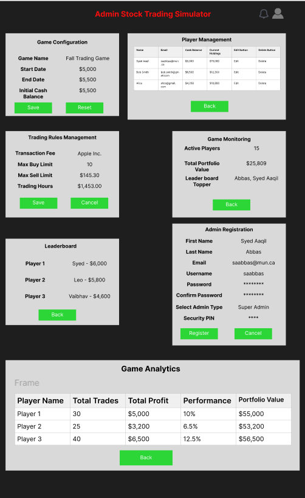

# Stock Trading Simulation Game

## Proposal (taken from 'saabbas' branch)
This project involves the development of a stock trading simulation web application where players can engage in a competitive trading environment. Each player will receive an initial cash balance and use it to buy and sell stocks based on real-time NYSE prices. The goal is to maximize the portfolio's value by the end of the simulation. Players will be able to view their portfolio's performance and make strategic decisions about buying and selling stocks to outperform other players.

From the player's perspective, the game focuses on decision-making in a simulated trading environment. Players will be able to buy and sell stocks, track their portfolio’s value, and compare their performance with others if the optional competitor viewing feature is enabled. The game concludes by declaring the player with the highest portfolio value as the winner.

From the admin's perspective, the platform provides tools to configure and manage the simulation. Admins can register players, create games with customizable start and end dates, manage trading rules, and declare winners. Admins will also have access to a dashboard to monitor the overall performance of the simulation and individual player activities.

## Screens
Below are conceptual diagrams that represent the graphical user interface (GUI) for both players and admins:

- **Player GUI**: This screen will display the portfolio with a summary of current holdings, cash balance, and an option to buy or sell stocks. The player will also be able to track stock prices in real-time.

- **Admin GUI**: This screen will allow admins to create and configure games, manage players, and oversee the game’s progress.

## Features
The features of the stock trading simulation game are outlined below:

| ID  | Name                     | Access By | Short Description                                       | Expected Implementation | Source of Idea                |
|-----|--------------------------|-----------|---------------------------------------------------------|-------------------------|--------------------------------|
| 01  | Player registration       | Player    | Players register for a specific game                    | Must implement           | Project instructions           |
| 02  | Game duration             | Admin     | Configure start/end dates for each game                 | Likely to be done        | Project instructions           |
| 03  | Moving average            | Player    | Feature to show moving averages on candlestick charts    | Optional                 | Web sources (e.g., Investopedia)|
| 04  | Buy stock                 | Player    | Players can buy stock at current market prices           | Must implement           | Core feature                   |
| 05  | Sell stock                | Player    | Players can sell stock at current market prices          | Must implement           | Core feature                   |
| 06  | Real-time NYSE prices     | Player    | Display real-time stock prices                           | Must implement           | Real-time data from NYSE API    |
| 07  | Portfolio value tracking  | Player    | Displays the current value of a player's portfolio       | Must implement           | Project instructions           |
| 08  | Winner declaration        | Admin     | Declare the player with the highest portfolio value as the winner | Must implement   | Project instructions           |
| 09  | Competitor portfolio viewing | Player  | Option to view other players' portfolios                 | Optional                 | Feature enhancement idea       |
| 10  | Transaction fees          | Player    | Fees applied to buy/sell actions                        | Optional                 | Feature enhancement idea       |
| 11  | Admin dashboard           | Admin     | Admins can track game and player activities              | Must implement           | Project instructions           |
| 12  | Trading logs              | Player    | Keep track of all buy/sell actions by players            | Optional                 | Feature enhancement idea       |
| 13  | Start amount configuration | Admin    | Admins can configure the starting amount for players     | Must implement           | Core feature                   |
| 14  | Stock market news feed    | Player    | A news feed related to the stocks being traded           | Optional                 | Web sources                    |
| 15  | Game analytics            | Admin     | Provides analytics on player performance and game statistics | Optional             | Project instructions           |
| 16  | Email notifications       | Admin/Player | Sends email notifications about game updates and player performance | Optional | Feature enhancement idea       |
| 17  | In-game chat              | Player    | Players can communicate with each other during the game  | Optional                 | Feature enhancement idea       |
| 18  | Leaderboard               | Player    | Displays player rankings based on portfolio value        | Must implement           | Core feature                   |
| 19  | Historical data visualization | Player  | Visualize historical stock data and trends              | Optional                 | Web sources                    |
| 20  | Risk management tools     | Player    | Provides tools to analyze and manage risk in stock trades | Optional                | Web sources                    |
| 21  | Stock market simulator API | Player/Admin | Interface with an external API for stock market simulation | Must implement       | Core feature                   |
| 22  | Graphical portfolio view  | Player    | A graphical view of the player's portfolio               | Must implement           | Feature enhancement idea       |
| 23  | User profile management   | Player    | Allows players to manage their profile details           | Must implement           | Project instructions           |
| 24  | Game termination option   | Admin     | Allows admin to manually terminate the game              | Optional                 | Project instructions           |
| 25  | Dark mode for UI          | Player    | UI can be switched to dark mode for better visual experience | Optional              | Web sources                    |
| 26  | Two-factor authentication | Admin/Player | Security feature for login                            | Optional                 | Web sources                    |
| 27  | Real-time notifications   | Player    | In-game notifications for major stock movements          | Optional                 | Web sources                    |
| 28  | API for external integrations | Admin  | Provides API for integration with other platforms        | Optional                 | Web sources                    |
| 29  | Dividend tracking         | Player    | Tracks dividend payments and reinvestments               | Optional                 | Feature enhancement idea       |
| 30  | Trade prediction algorithms | Player   | Predictive models to assist in stock trades              | Optional                 | Feature enhancement idea       |

### Moving Average (03)
This feature would add a moving average to the candlestick chart used in the player’s portfolio. The moving average helps players identify stock price trends and make informed decisions about buying or selling stocks. Although optional, it could significantly enhance the user experience for players familiar with technical analysis tools.

## References
American Psychological Association. (2020). *Publication manual of the American Psychological Association* (7th ed.).

# Design and Implementation Plans (Taken from 'sajeda' branch)

For our project, we have created a document called design.md, which covers both the proposed component architecture and the coding tools that we are expecting to use during the project process. We have divided this document into two main sections: Architecture and Tools and Packages. We decided to divide the work for this assignment, and after discussing it as a team, I have been assigned architecture diagram and Vaibhav will handle the tools and technology part.

### Architecture:

I have prepared general web framework architecture diagram according to our project details. I followed the same structure that were added in the class material. I added/modified the module names and details according to our project and based on the team's discussion. Kindly find the below general web framework architecture diagram: 

### Tools and Packages (Taken from 'vaibhav' branch): 

I, Vaibhav, am responsible for this section. I’ll list the tools and packages we expect to use in building the project. If we realize we need something additional later, I’ll update this document to reflect that and describe what we’re looking for.

We decided to divide the work for this assignment, and after discussing it as a team, I took on the task of focusing on the tools and technology while Sajeda is working on the architecture diagram.

## Tools and Technology

For our stock trading simulation web application, we plan to use the following technologies:

### Languages:

We'll be working with JavaScript, HTML, and CSS for the main development. JavaScript will control dynamic behaviors on the front-end, while HTML will structure the pages, and CSS will handle the visual styling to make everything look professional and user-friendly.

### Front-end:

We’re going to have both static and dynamic web pages. The static pages will display content that doesn’t need to change often, such as the homepage or game rules. Meanwhile, the dynamic pages will handle things like stock price updates and portfolio changes, using JavaScript to provide users with a smooth, interactive experience.

### Server Environment:

On the server side, we’ll use Node.js. This will allow us to run JavaScript on the server and handle tasks such as responding to user requests and managing data flow between the client and the server.

### Server-side Web Framework:

We’ll be using Express.js as our web framework. Express will help us create routes and manage API requests easily, so we can handle things like buying and selling stocks, and updating user portfolios efficiently.

### Database:

For storing data, we’ll use MongoDB. This database will keep track of user profiles, trading histories, and any other information related to the simulation. It’s a flexible database, so it’ll help us manage data efficiently as the project evolves.

### Code Repository:

Our project’s code will be hosted on GitHub Classroom. This will allow the team to collaborate, track changes, and ensure everyone is working on the latest version of the code.

## Process Model (Taken from 'derasdelgado_processModel' branch)

### Overview

This section aims to cover the process model of our current project. This will guide our project's lifecycle along the way. Changes, if needed, will be described here accordingly. Following the figure 2.3 from Sommerville, our overall process can be summarized into the following procedures:

* Product backlog processes:
The section *Features* has all the items to be implemented in this project. Each sprint, we will have to gather some of those features to be implemented. We will sort them having in mind what will be delivered at the end of the sprint.

* Sprint backlog processes:
During the very first Scrum meeting of each sprint, we will take some of the items contained in the product backlog and further discuss about them, expanding on their description and clarifying any questions about them. Once they are sufficiently explained, they will be used to construct the Sprint backlog. From this backlog, we can assign to each team member the tasks on which each one of us will work.

### SCRUM meetings

As each Scrum meeting has the goal to further advance the project, we will describe in this section a rough idea on the goals and results expected from our general meetings:
* We will have 2 defined roles: Scrum master and note taker, these roles will rotate each meeting.
* The meetings will be short (no more than 15 to 20 minutes in total)
* We will keep track on the individual members' attendance. 
* Progress will be measured by checking on our project Kanban board, and compare this to the previous meeting status.
* Each meeting will be recorded, with the meeting notes serving as a *tl;dr* of the relevant ideas and issues.
* We will alllocate some time for each member to explain on their progress, voice their concerns and issues.

Special considerations made for both the first and last meeting in the sprint:
* The first meeting will:
    * Include a procedure on how the pull requests will be handled.
    * Include a section for assigning tasks for the sprint.
* The last meeting will:
    * Identify the deliverables artifacts (parts, modules, sections)

### Source control strategy

We will use Github as a source control tool for our project. Each member working on a feature will have to create a branch. In order to be merged, this person will have to create a pull request that has to be **reviewed and accepted** by each team member before merging to main branch.

Some considerations for accepting a merge request:
* It has to be done **at most** one day before (24 hours) a task's deadline, so we have time to evaluate the impact on this feature to the overall project.
* It has to be properly commented (proper usage of Jsdoc) and tested to be considered *production-ready*.

The last item is important to form a product increment into the next sprint.

If the pull request fails to meet the above criteria, and the sprint is over, it will be returned to the product backlog and reviewed for the next sprint.

### Kanban board

The Kanban board we will use is the one provided in Github Projects section. For now, we will have the following structure:
* Sprint Backlog:
Items here are created from refining a feature from the Product Backlog. The items here are a subset of those pertaining a particular sprint. This items will be assigned to a member here.
* To Do: The team member has this task assigned.
* In progress: The team member is currently working on this task.
* Pending review: All work is done, it is just waiting on a team review to be accepted.
* Done: The work was accepted and now is part of the main branch.

These are accesible for the whole team to be reviewed and commented. The main idea of the Kanban board is to measure the progress of a particular task within the sprint.

### Issue tracker

Along the way on the project's development, bugs will appear or new functionalities will be discovered and these can impact the project. The issue tracker in GitHub will allow us to discuss ideas and problems found along a particular task. With the usage of templates we can create bug reports or add features.

This help us to inform a team member if further coding is needed to fix a partiuclar part on their task.

### Other tools and techniques

Means of communication (from the most to the least formal):
* In class meetings
* Google Meets for our Scrum meetings/recordings.
* Microsoft Teams to provide important class/project deadlines and checking upon each other in our tasks.
* WhatsApp to discuss class issues and logistics.

### Note:

All of the information mentioned above was discussed during our team’s scrum meetings. We’ve ensured that everyone is on the same page regarding our roles and responsibilities. If any changes or updates arise in the future, I will make the necessary adjustments in this repository to keep everything current. 
