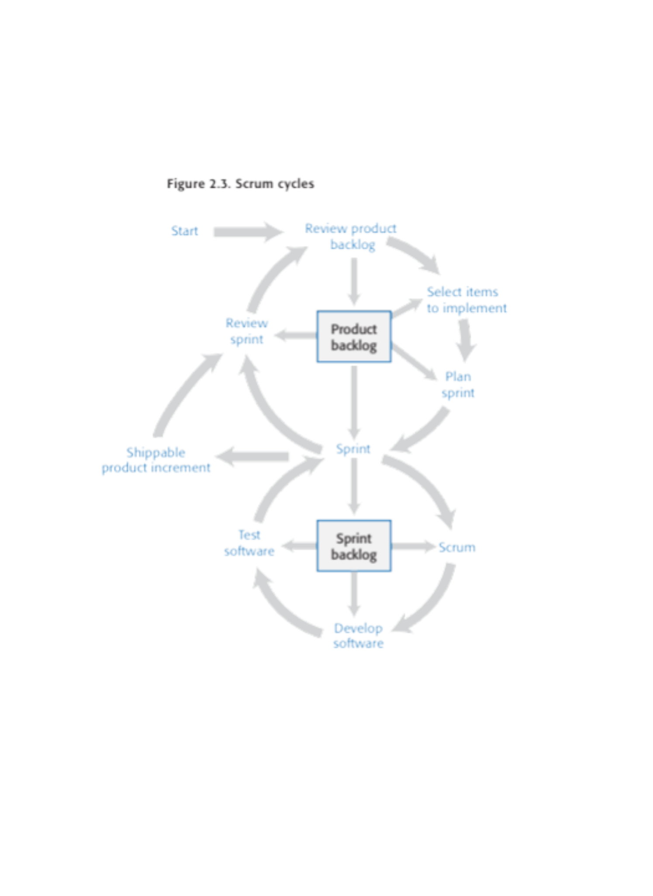

# Project Overview

This semester's project will be implementation of a stock trading simulation or "game" as a web application with a server portion and a browser/HTML front end.  Simulation players will compete to see whose "pretend" trading portfolio has the highest value at the end of the game/competition/simulation. You only have to support sell and buy actions, other advanced trading actions would be possible additional features.

Your server/application will have to support the following features:
* register players for the game simulation
* provide all players a starting cash account in their simulation portfolio
* allow player buy and sell actions at the current NYSE prices
* keep track of each player's portfolio and its value
* declare a winner at the end of the game
* maintain player login and profile information
* admin users that can create games

Your application will support additional features chosen by your team, such as:
* optional viewing of competitor's portfolios
* optional costs to buy/sell transactions (fees)
* tracking all trades and activities of a player during the game
* time and starting amount game configuration
* and other features you should come up with

# Part I

## Proposal

In the project doc folder, create a project proposal called `proposal.md` which will outline a description of the term project.  Do not limit your proposal to things you already know how to do; there is opportunity to expand your skills during the course.  This plan is preliminary, so we expect it to change and be revised over time as your learn more and come up with additional ideas.

Your proposal should have the following sections:

### Description

One or two paragraphs describing the trading game/simulation from the player's perspective and the admins perspective.

### Screens

Two or more drawings/diagrams showing what the web GUI interface will look like for the players and possibly for the game admins as well. Put the drawings should be in a format to be incorporated as an image into the proposal markdown document. Label and explain the images.

### Features

List the features your application will have in a table like this:

|ID|Name|Access By|Short Description|Expected Implementation|Source of Idea|
|--|----|---------|-----------------|--------|--------------|
|01|Player registration|Player|players register for a specific game|Must implement|Project instructions|
|02|Game duration | Admin| Configure start/end of each game individually| Likely to be done|Lots of other games I know|
|03|Moving average|Player|An added feature to candlestick charts|Probably not unless its easy|Web sites like [investopedia](https://www.investopedia.com/terms/m/movingaveragechart.asp#:~:text=A%20moving%20average%20(MA)%20chart,data%20for%20each%20time%20period.)|

Your team should come up with 30 or more features. It's OK to use other teams as a source of feature ideas, but prepare your own team document. And do not forget to **include an attributions document** in your doc folder to acknowledge any substantial help you or your team receive.

##### Moving Average (03)

Any features that require a lengthy explanation can add a long description section after the table, with a title similar ot this section.

## Features are for Backlog

In proposing additional features DO NOT worry about how the features would be implemented or whether they are too difficult; these ideas will form the basis of an initial project backlog, so there is no commitment to implement all the features

## Design and implementation Plans

Create an additional document called *design.md* covering the proposed component architecture and coding tools you expect to use during the project process. The document should have the following sections:

### architecture

Start with the general web framework architecture diagram provided in the class materials. Substitute the abstract module names and details with module names and details appropriate to your project. If you have additional ideas about 

### Tools and packages

List the tools and packages you expect to use in your code implementation. If you expect to need a tool or package you will find later, describe what you are looking for. Use a bullet list such as this:

* Languages: javascript, HTML, css
* Front-end: dynamic and static web pages
* Server environment: nodejs
* Code repository: github classroom distribution
* Server side web framework: expressjs
* Database: not yet decided but we will need one

Note that the above list are tools you are expected by the instructor to use in the project, and if the team wants to adopt others or additional frameworks (such as React) it will require approval of the instructor. However, you should include any tools you are considering in your bullet list. (e.g ORM, front-end design tools, session management, authentication, middleware, and so on.)  

## Process model and methodology
Create an additional document called *process_model.md* covering the process model the team will use for their sprints. Start with figure 2.3 from Sommerville as a reference diagram for the rest of this document.
 

 Add a brief general description of your process model before proceeding to the following sections

If your team wants to modify the diagram to better express their process model, explain any such modification.

 Add the following sections to the document, explaining how each of these items relate to the sprint elements in the diagram and adding any details the team has established about how (methods) for the element in your process model. 

 ### SCRUM meetings

 You have developed details on the SCRUM meeting in a previous assignment, so you should incorporate your team results here. Also, how do meeting and the meeting notes relate to the reference diagram elements?

 ### Source control strategy

 Lay out the source strategy for your project incorporating the use of git, github and pull requests in particular. What does this relate to in the diagram?

 ### Kanban board

 The instructor has prescribed the use of the github project board. We will look at this tool in subsequent classes, but in the meantime outline how you think a kanban board relates to any of the sprint elements in the diagram.

 ### Issue tracker

 The instructor has prescribed the use of the github issue tracker. We will look at this tool in subsequent classes, but outline how you think it relates to any of the sprint elements in the diagram.

 ### Other tools and techniques

 List any other tools or methods the team will adopt that relates the process model, and explain how each of these relates to the process model elements in the reference diagram. This could include on-line meeting tools, 

## Team profiles

Include team profiles in the doc folder.

## README contents

The repo README.md file usually contains a short description of the repo with a diagram of the folder contents.

# Part I individual

Your individual team members' task branch(es) should contain their contributions to Part I of the team project.

