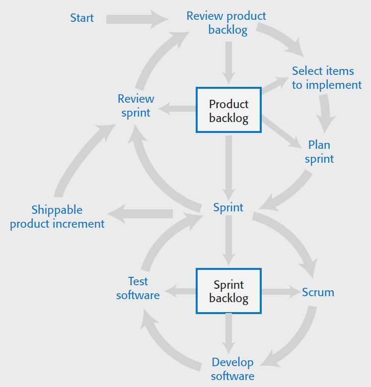

## Process Model

### Overview

This section aims to cover the process model of our current project. This will guide our project's lifecycle along the way. Changes, if needed, will be described here accordingly. Following the figure 2.3 from Sommerville, our overall process can be summarized into the following procedures:

* Product backlog processes:
The section *Features* has all the items to be implemented in this project. Each sprint, we will have to gather some of those features to be implemented. We will sort them having in mind what will be delivered at the end of the sprint.

* Sprint backlog processes:
During the very first Scrum meeting of each sprint, we will take some of the items contained in the product backlog and further discuss about them, expanding on their description and clarifying any questions about them. Once they are sufficiently explained, they will be used to construct the Sprint backlog. From this backlog, we can assign to each team member the tasks on which each one of us will work.

### SCRUM meetings

As each Scrum meeting has the goal to further advance the project, we will describe in this section a rough idea on the goals and results expected from our general meetings:
* We will have 2 defined roles: Scrum master and note taker, these roles will rotate each meeting.
* The meetings will be short (no more than 15 to 20 minutes in total)
* We will keep track on the individual members' attendance. 
* Progress will be measured by checking on our project Kanban board, and compare this to the previous meeting status.
* Each online meeting will be recorded, with the meeting notes serving as a *tl;dr* of the relevant ideas and issues.
* We will alllocate some time for each member to explain on their progress, voice their concerns and issues.
    * Every team member **has to** explain his/her current work by showing something useful for feedback, such as a diagram, working/non working code, screen captures, images in a piece of paper, but something.
* We will have **at least** 3 meetings per week, two after the class and another one over the weekend.

Special considerations made for both the first and last meeting in the sprint:
* The first meeting will:
    * Include a procedure on how the pull requests will be handled.
    * Include a section for assigning tasks for the sprint.
    * Feature analysis
        * Relevance classification
        * Identification on coupling parts/components
* The last meeting will:
    * Identify the deliverables artifacts (parts, modules, sections)

### Source control strategy (Pull Request strategy)

We will use Github as a source control tool for our project. Each member working on a feature will have to create a branch. In order to be merged, this person will have to create a pull request that has to be **reviewed and accepted** by each team member before merging to main branch.

Some considerations for accepting a merge request:
* It has to be done **at most** one day before (24 hours) a task's deadline, so we have time to evaluate the impact on this feature to the overall project.
* Each member has to include some evidence (screen captures or something) to show that they tested code on their machines and everything's working as intended.
* It has to be properly commented (proper usage of Jsdoc) and tested (unit testing or image/video evidence in case of webpage functionality/design) to be considered *production-ready*.
* The pull request should be self-explanatory.
* If the pull request is about existing *design* files (such as UML diagrams, or *md* files), no testing is needed (nor jsdoc), but all team members still have to agree on the changes to be accepted.
* We will need a new branch for every feature assigned. That way we can keep track on how the feature is going and pull from that branch without facing other features not implemented.

Pull requests can be done as soon as a feature/task is completed and *production-ready* considered. As some tasks are more important than others, this is expected and even encouraged (in the meetings)

If the pull request fails to meet the above criteria, and the sprint is over, it will be returned to the product backlog and reviewed for the next sprint.

### Code review
Code review process will be done outside scrum meetings, as these things take the most time. It is expected from all group members to showcase their work either in classroom or in online meetings. There should be some feedback to the code showcased, because some functionalities or new features can be discovered along the way of showing work to others. After the showcase, other team members can ask what-if questions regarding abnormal data input, or better yet, roam free (unguided) through the new features.

As a minimum (Strictly enforced by our process model):
* The code can be showed to at least one other team member. It is better to include those that are working in a similar feature, as they usually provide better feedback than those working in other areas of the project.
* The functionality claimed for the code revision should be covered in full detail.
* New code should not break existing code. Everything working before should still be working.
* All previous test cases should still pass.
* New code ready for pull requests are expected to have both test cases (new and old passing) and docstrings.

### Kanban board

The Kanban board we will use is the one provided in Github Projects section. For now, we will have the following structure:
* Sprint Backlog:
Items here are created from refining a feature from the Product Backlog. The items here are a subset of those pertaining a particular sprint. This items will be assigned to a member here.
* To Do: The team member has this task assigned.
* In progress: The team member is currently working on this task.
* Pending review: All work is done, it is just waiting on a team review to be accepted.
* Done: The work was accepted and now is part of the main branch.

These are accesible for the whole team to be reviewed and commented. The main idea of the Kanban board is to measure the progress of a particular task within the sprint.

This also allow us to further break one feature into smaller chunks of tasks for us to track and complete.

### Issue tracker

Along the way on the project's development, bugs will appear or new functionalities will be discovered and these can impact the project. The issue tracker in GitHub will allow us to discuss ideas and problems found along a particular task. With the usage of templates we can create bug reports or add features.

This help us to inform a team member if further coding is needed to fix a partiuclar part on their task.

Every doubt or question has migrated to the issue tracker and not into the Team's chat nor Whatsapp. This is done so that there is a record the question was asked in the first place.

### Performance reviews

This documents can be found inside the **doc/performance_review** folder. Each file showcases the author's perspective on his/her teammates' performance. All the files start with *review_by_* followed by the member's name. This serves as a review on each team member's performancde after a particular sprint and **can be commented back**. This document should be simple and directed at improving contribution to the team performance:
* Team members must participate and contribute their perspective, which should be framed in a supportive, respectful and professional manner. They are directed to improvement, not to complaints.
* Honesty is the most valuable characteristic, it will help us to improve upon our work. So this document has to be careful and thoughtful in order to be effective.
* All suggestions are appreciated, even if an individual has an excellent performance, there's always some way to improve.
* Although categories are provided here, they are only for clarity and readability. Anyone can add more if needed. While these categories are not mandatory, they ***are strongly suggested***. 
* **Word limit is 120 words**, so it doesn't become a book, hopefully not a best-seller at least.
* Categories to consider:
    * *Time management skills*: Does this person delivers before the deadline?, how often does this person offers updates on his/her work?, how often does this person moves the deadline on his/her tasks?,...
    * *Communication*: Does this person use the issue tracker to ask questions?, how ofter does this person provide information or feedback on meetings?,...
    * *Collaboration*: Is this person active in the kanban board? Is this person aware of other's work? Is this person aware on how his/her work can affect someone else's?...
    * *Resourcefulness*: Does this person provide useful help to other team members?

### Attributions file
This file, located in *doc* folder includes all references used to build the project, including a small description on how this was useful.

## Deliverables

After all work is done in a branch for tasks or features, we have to provide some evidence of the working software. Evidence is reflected through, but not limited to:
* Short videos showcasing the functionality.
* A brief description on what's working and what is not.
* An overview of all the features, with a percentage of functionality. This document is called *sprintN_review.md*, located inside the *sprint_retrospectives* folder. The *N* stands for the sprint iteration.
* A short instruction section to guide users to deploy the sistem in the *README.md* file

### Pull request deadline (Sprint 3)
This is defined to be dec 7, at 23:59 PM.

### Other tools and techniques

#### Official means of communication (from the most to the least formal):
* In class meetings
* Issue tracker
* Kanban board
* Google Meets for our Scrum meetings/recordings.

#### Relaxed means of communication:
* Microsoft Teams to provide important class/project deadlines and checking upon each other in our tasks.
* WhatsApp to discuss class issues and logistics.
