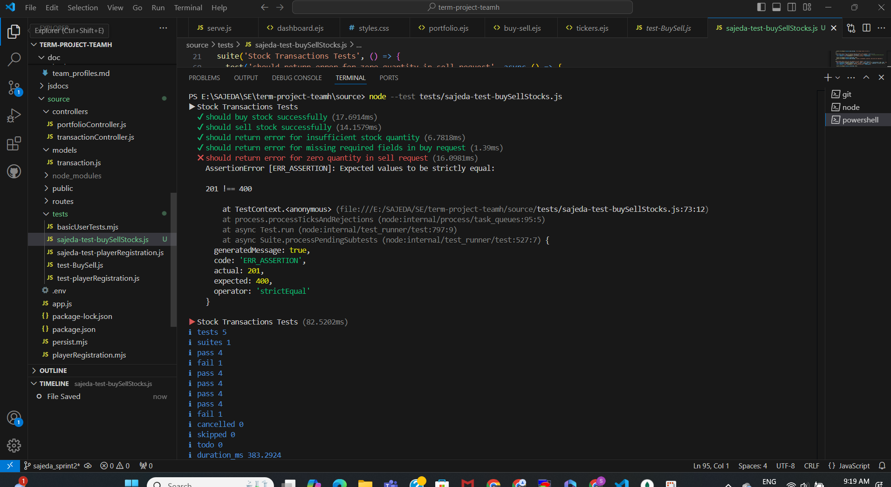
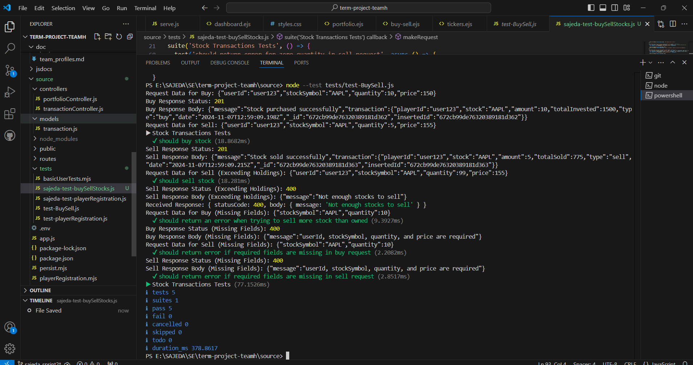
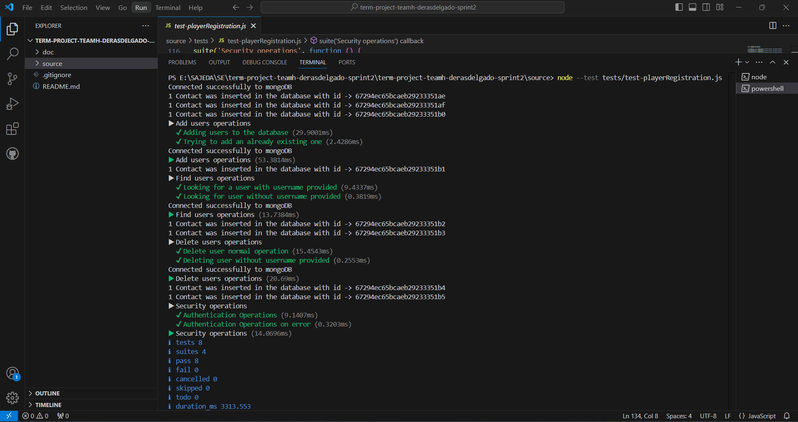
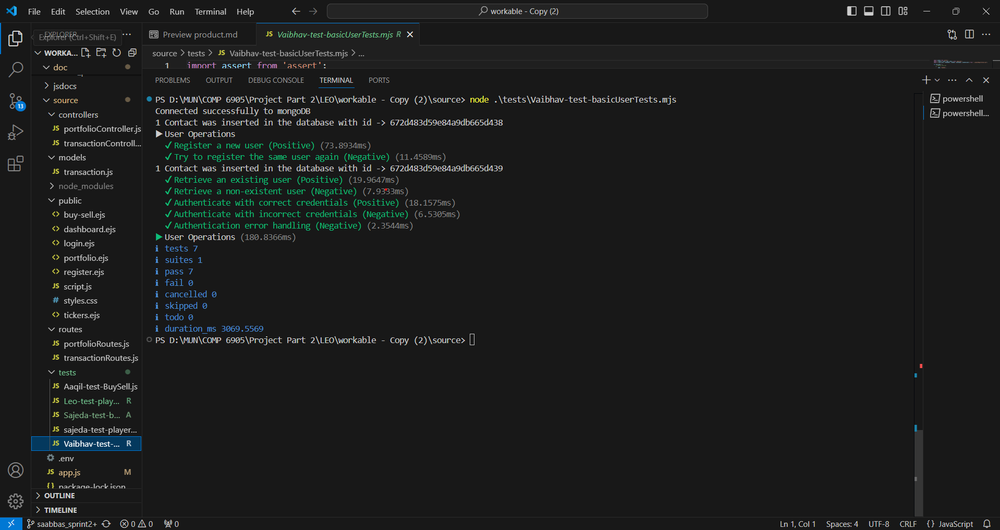
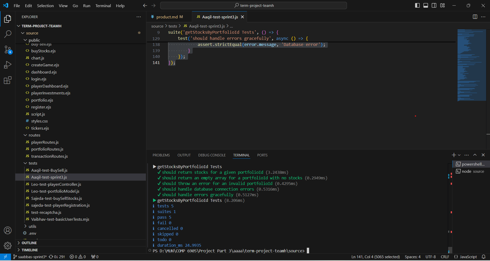
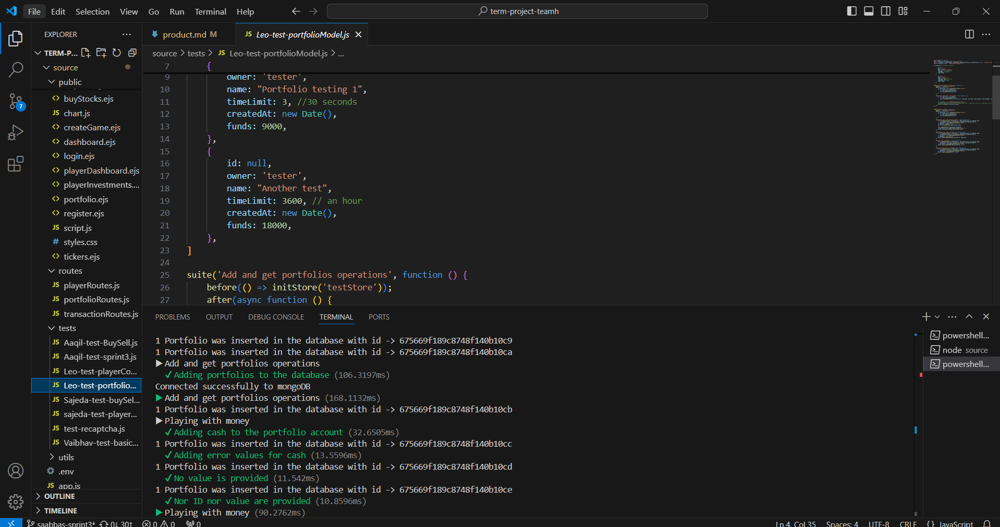
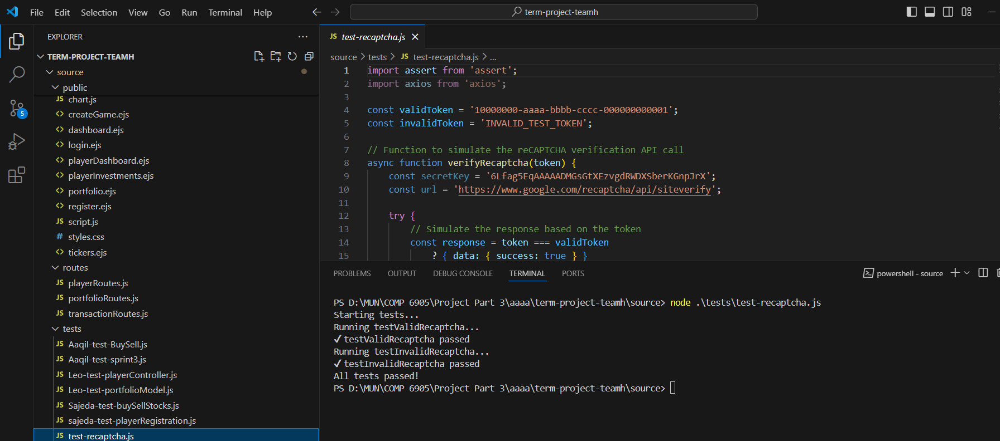

# **Product Development Overview**

## **Current Status and Planned Development of Product Features for Sprint 1, 2, and 3**

### **Sprints Overview**

The development of the game simulation project has been organized into three main sprints. Sprint 1 focused on the initial setup, architectural foundations, and core feature implementations. Sprint 2 aimed to refine these features, add new functionalities, and address feedback provided by Professor Brown. Sprint 3 completed the remaining features, finalizing all game functionalities and polishing the project.

## **Overall Project Progress: 100% Complete**
All features, including core functionalities, admin controls, player interactions, and final touches, have been successfully implemented. The project is now fully operational and ready for launch.

## **What Went Well**

### **Player Registration and Authentication**
- **Completed**: Players can now register and authenticate using email and password, with **SHA3 encryption** ensuring password security.
- **Validation**: Basic validation on email, password, and repeated passwords has been successfully implemented.

### **Buy and Sell Functionality**
- **Completed**: The game now allows players to buy and sell stocks at real-time NYSE prices, ensuring an authentic trading experience.

### **Tracking Player Portfolios**
- **Completed**: Players' portfolios are tracked in real-time, and their portfolio values are updated as stock prices fluctuate, providing up-to-date feedback on performance.

### **Graphical User Interface (GUI) Enhancements**
- **Completed**: The GUI has been further improved in Sprint 3, incorporating a graphical display of portfolio performance, GUI refinements, and an intuitive interface for managing simulations and game sessions.

### **Session Management**
- **Completed**: The login system uses **Express.js session library** to manage player sessions and profile information, ensuring smooth player experience throughout their gaming session.

### **Game Administration Features**
- **Admin Dashboard**: A robust admin dashboard now allows administrators to manage game sessions, view player data, and oversee overall progress in real-time.  
- **Game Creation Page**: Admins can now easily create and configure new game instances through a streamlined game creation page.

### **Security and Accessibility**
- **Google reCAPTCHA Integration**: Google reCAPTCHA has been successfully implemented on the login page to enhance security and prevent unauthorized access. A design glitch was resolved to ensure compatibility across all devices.

### **Simulation Modes and Player Experience**
- **Speed Mode for Simulation**: A speed mode option was added, allowing players to experience faster simulations using historical stock data.  
- **Starting Cash for Players**: Players now receive an initial cash balance to start their trading journey, making the gameplay more engaging and accessible.

### **Winner Declaration**
- **Winner Declaration Page**: A dedicated page announces the winner at the end of the simulation, providing a clear and engaging conclusion to the game session.

## **Features and Updates Sprint 3**

### **Sajeda's Feature**  
- **Graphical Display of Portfolio Performance**:  
  A visual representation of portfolio performance over the duration of the simulation has been added, helping players easily track their investment progress.

- **Create Game Page**:  
  A new page has been designed where admins can create and configure new game instances, streamlining the process for initiating simulations.

  **Fixed Google reCAPTCHA Design Glitch**:  
  Resolved a design glitch in the Google reCAPTCHA integration on the login page, ensuring it displays correctly across all devices and browsers for a seamless user experience.

- **Existing Feature**:  
  **GUI Improvements**:  
  Several enhancements have been made to improve the overall look and feel of the GUI, ensuring a more polished and professional user experience.

### **Leo's Feature**
- **Speed Mode for Simulation**:  
  A speed mode setting has been added, allowing players to run the simulation at a faster-than-real-time pace using historical stock data. This adds flexibility and speed to the gameplay experience.

- **CreateSuperAdmin Script**:  
  Developed a script to automatically create a super admin account during the initial setup process. This ensures that the system is accessible and manageable by a top-level administrator from the start.

- **Starting Cash for Players**:  
  All players are now provided with an initial cash balance in their simulation portfolios, giving them the necessary funds to begin trading.
- **Existing Feature**:  
  **Admin Game Creation**:  
  Admin users now have the ability to create new game instances, enabling the creation and management of simulations for different sets of players.

### **Aaqil's Feature**
- **Admin Dashboard**:  
  The admin dashboard has been implemented, allowing administrators to manage and oversee game sessions, view player data, and track game progress in real-time.

- **Existing Feature**:  
  **Keep Track of Player's Portfolio**:  
  The portfolio tracking system from Sprint 2 has been fully integrated, ensuring real-time updates on portfolio values as players engage in buying and selling stocks.

### **Vaibhav's Feature**
- **Winner Declaration Page**:  
  A page has been created to declare the winner at the end of the simulation, finalizing the game session and announcing the top-performing player(s).

- **Existing Feature**:  
  **Declare a Winner at the End of the Game**:  
  The functionality to declare a winner at the end of the game has been successfully implemented, ensuring the game ends with a clear declaration of the top performer.

- **Extra Feature**:  
  **Google reCAPTCHA Integration on Login Page**:  
  A Google reCAPTCHA feature has been added to the login page to enhance security by preventing automated scripts or bots from gaining unauthorized access to the system. This ensures that only legitimate users can log in to participate in the simulation. 

## **What Does Not Work**

- All major features are now fully operational. No critical issues remain, and the project has reached its planned completion.

## **Additional Resources:**

To help with understanding what is working and what is not, we have included the following resources:

- **Video Presentation**:  
  - We have recorded the final working videos for our project to showcase our project in brief. 
  - The video demonstrates the working features like player registration, login, stock buying/selling, portfolio tracking, admin dashboard, create a game, announce a winner, and the newly developed GUI.
  - [Watch the first video on Loom](https://www.loom.com/share/c4ef3d1198834871b523923528fdd88d?sid=55dd11f0-4af8-4a74-9bc6-63546a414c0b)  
  - [Watch the second video on Loom](https://www.loom.com/share/963bcf666f344e04bd30202b2fb50c7c?sid=e5688f98-df81-4a6e-a0b0-0a79512352c7) 

## **Test Cases:**

### **Team Member Tasks and Screenshots (Sprint 2)**

- **Sajeda**:  
  - **Task**: GUI Implementation and Enhancements  
  - **Test Screenshot**: 

- **Aaqil**:  
  - **Task**: Admin Dashboard, Buy and Sell functionality, Portfolio Tracking  
  - **Test Screenshot**: 

- **Leo**:  
  - **Task**: Speed Mode functionality, Player Registration and Login, Admin Game Creation  
  - **Test Screenshot**: 

- **Vaibhav**:  
  - **Task**: Winner Declaration Page, Session Management  
  - **Test Screenshot**: 

### **Team Member Tasks and Screenshots (Sprint 3)**

- **Sajeda**:  
  - **Task**: Performed Unit Test for Leo's Feature   
  - **Test Screenshot**: 

  - **Task**: Performed Unit Test for Aaqil's Feature   
  - **Test Screenshot**: 

  - **Task**: Performed Unit Test for Vaibhav's Feature   
  - **Test Screenshot**: 

- **Aaqil**:  
  - **Task**: Each Player's Portfolio  
  - **Test Screenshot**: 

- **Leo**:  
  - **Task**: Portfolio Model
  - **Test Screenshot**: 

- **Vaibhav**:  
  - **Task**: Recaptcha Unit Test  
  - **Test Screenshot**: 

With the completion of Sprint 3, the project is now 100% finished and ready for launch, with all features fully implemented and tested.