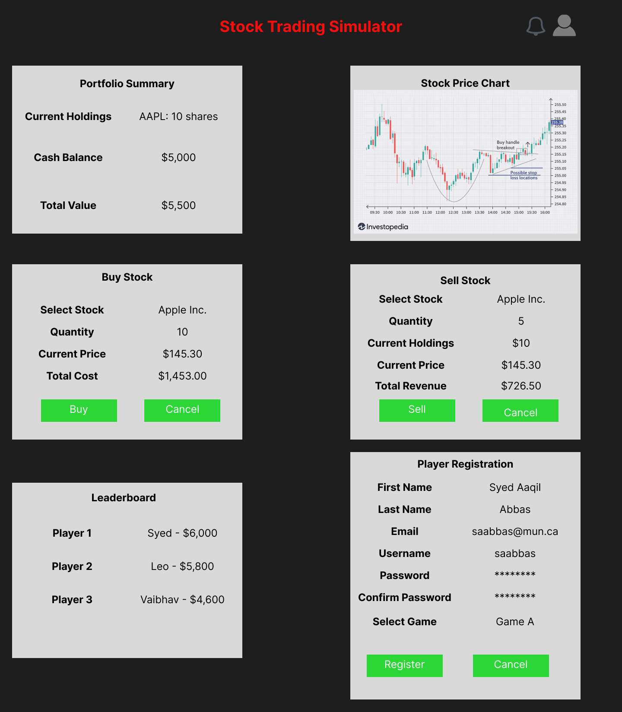
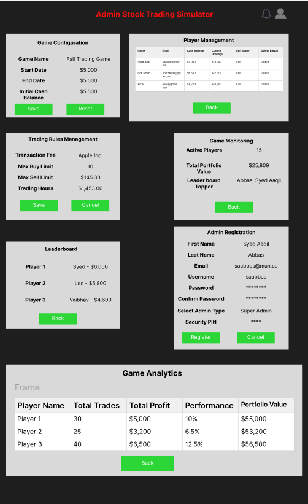

## Proposal
This project involves the development of a stock trading simulation web application where players can engage in a competitive trading environment. Each player will receive an initial cash balance and use it to buy and sell stocks based on real-time NYSE prices. The goal is to maximize the portfolio's value by the end of the simulation. Players will be able to view their portfolio's performance and make strategic decisions about buying and selling stocks to outperform other players.

From the player's perspective, the game focuses on decision-making in a simulated trading environment. Players will be able to buy and sell stocks, track their portfolio’s value, and compare their performance with others if the optional competitor viewing feature is enabled. The game concludes by declaring the player with the highest portfolio value as the winner.

From the admin's perspective, the platform provides tools to configure and manage the simulation. Admins can register players, create games with customizable start and end dates, manage trading rules, and declare winners. Admins will also have access to a dashboard to monitor the overall performance of the simulation and individual player activities.

## Screens
Below are conceptual diagrams that represent the graphical user interface (GUI) for both players and admins:

- **Player GUI**: This screen will display the portfolio with a summary of current holdings, cash balance, and an option to buy or sell stocks. The player will also be able to track stock prices in real-time.

- **Admin GUI**: This screen will allow admins to create and configure games, manage players, and oversee the game’s progress.

## Features
The features of the stock trading simulation game are outlined below:

| ID  | Name                     | Access By | Short Description                                       | Expected Implementation | Source of Idea                |
|-----|--------------------------|-----------|---------------------------------------------------------|-------------------------|--------------------------------|
| 01  | Player registration       | Player    | Players register for a specific game                    | Must implement           | Project instructions           |
| 02  | Game duration             | Admin     | Configure start/end dates for each game                 | Likely to be done        | Project instructions           |
| 03  | Moving average            | Player    | Feature to show moving averages on candlestick charts    | Optional                 | Web sources (e.g., Investopedia)|
| 04  | Buy stock                 | Player    | Players can buy stock at current market prices           | Must implement           | Core feature                   |
| 05  | Sell stock                | Player    | Players can sell stock at current market prices          | Must implement           | Core feature                   |
| 06  | Real-time NYSE prices     | Player    | Display real-time stock prices                           | Must implement           | Real-time data from NYSE API    |
| 07  | Portfolio value tracking  | Player    | Displays the current value of a player's portfolio       | Must implement           | Project instructions           |
| 08  | Winner declaration        | Admin     | Declare the player with the highest portfolio value as the winner | Must implement   | Project instructions           |
| 09  | Competitor portfolio viewing | Player  | Option to view other players' portfolios                 | Optional                 | Feature enhancement idea       |
| 10  | Transaction fees          | Player    | Fees applied to buy/sell actions                        | Optional                 | Feature enhancement idea       |
| 11  | Admin dashboard           | Admin     | Admins can track game and player activities              | Must implement           | Project instructions           |
| 12  | Trading logs              | Player    | Keep track of all buy/sell actions by players            | Optional                 | Feature enhancement idea       |
| 13  | Start amount configuration | Admin    | Admins can configure the starting amount for players     | Must implement           | Core feature                   |
| 14  | Stock market news feed    | Player    | A news feed related to the stocks being traded           | Optional                 | Web sources                    |
| 15  | Game analytics            | Admin     | Provides analytics on player performance and game statistics | Optional             | Project instructions           |
| 16  | Email notifications       | Admin/Player | Sends email notifications about game updates and player performance | Optional | Feature enhancement idea       |
| 17  | In-game chat              | Player    | Players can communicate with each other during the game  | Optional                 | Feature enhancement idea       |
| 18  | Leaderboard               | Player    | Displays player rankings based on portfolio value        | Must implement           | Core feature                   |
| 19  | Historical data visualization | Player  | Visualize historical stock data and trends              | Optional                 | Web sources                    |
| 20  | Risk management tools     | Player    | Provides tools to analyze and manage risk in stock trades | Optional                | Web sources                    |
| 21  | Stock market simulator API | Player/Admin | Interface with an external API for stock market simulation | Must implement       | Core feature                   |
| 22  | Graphical portfolio view  | Player    | A graphical view of the player's portfolio               | Must implement           | Feature enhancement idea       |
| 23  | User profile management   | Player    | Allows players to manage their profile details           | Must implement           | Project instructions           |
| 24  | Game termination option   | Admin     | Allows admin to manually terminate the game              | Optional                 | Project instructions           |
| 25  | Dark mode for UI          | Player    | UI can be switched to dark mode for better visual experience | Optional              | Web sources                    |
| 26  | Two-factor authentication | Admin/Player | Security feature for login                            | Optional                 | Web sources                    |
| 27  | Real-time notifications   | Player    | In-game notifications for major stock movements          | Optional                 | Web sources                    |
| 28  | API for external integrations | Admin  | Provides API for integration with other platforms        | Optional                 | Web sources                    |
| 29  | Dividend tracking         | Player    | Tracks dividend payments and reinvestments               | Optional                 | Feature enhancement idea       |
| 30  | Trade prediction algorithms | Player   | Predictive models to assist in stock trades              | Optional                 | Feature enhancement idea       |

### Moving Average (03)
This feature would add a moving average to the candlestick chart used in the player’s portfolio. The moving average helps players identify stock price trends and make informed decisions about buying or selling stocks. Although optional, it could significantly enhance the user experience for players familiar with technical analysis tools.

## References
American Psychological Association. (2020). *Publication manual of the American Psychological Association* (7th ed.).